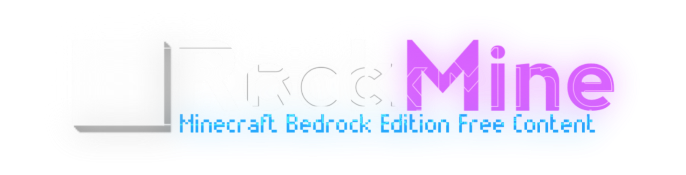

**Rock Mine** uma simples plataforma para baixar addons, texturas e mapas para Minecraft Bedrock. Criamos um ambiente moderno, rápido e seguro para a comunidade, com conteúdo mais fácil e confiável.

## Tecnologias Utilizadas

- ⚡ **NextJs** – Framework moderno para aplicações web rápidas e escaláveis.
- 🔐 **Auth.js** – Autenticação segura e integrada.
- 🎨 **TailwindCSS** – Estilização eficiente e responsiva.

## Recursos

- ✨ **Design moderno e responsivo**
- 🔍 **Busca avançada e filtros inteligentes**
- 👨‍🎓 **Sistema de login e perfis para criadores**

## Metas

- [x] **Pagina de addon**
- [x] **Sistema de login**
- [x] **Resposividade**
- [x] **Settings page**
- [ ] **Icons melhore**
- [ ] **Abri para o publico** (Qualquer pode envia seu projeto ;D)
- [ ] **Melhora desempenho**

## Como Usar

1. Acesse [Rock Mine](https://rock-mine.vercel.app/).
2. Pesquise o mod, addon ou mapa que deseja.
3. Clique para baixar de forma direta e segura.
4. Aproveite a melhor experiência no Minecraft Bedrock!

## Como Executar no seu PC

Siga os passos abaixo para rodar o projeto localmente:

### Pré-requisitos

- Node.js instalado (versão recomendada: LTS)
- Gerenciador de pacotes **npm** ou **yarn**

### Passos

1. Clone o repositório:
   ```sh
   git clone https://github.com/rock-mine/rock-mine
   ```
2. Acesse a pasta do projeto:
   ```sh
   cd rock-mine
   ```
3. Instale as dependências:
   ```sh
   npm install
   ```
4. Configure as variáveis de ambiente criando um arquivo `.env.local` com as credenciais necessárias seguindo o exemplo:

```env
# https://console.cloud.google.com/auth/clients
AUTH_GOOGLE_ID=
AUTH_GOOGLE_SECRET=

# https://discord.com/developers/applications
AUTH_DISCORD_ID=
AUTH_DISCORD_SECRET=
```

5. Inicie o servidor de desenvolvimento:
   ```sh
   npm run dev
   ```
6. Acesse `http://localhost:3000` no navegador e pronto xD.

## Contribuição

Quer ajudar a melhorar o Rock Mine? Fique à vontade para sugerir melhorias, reportar bugs ou contribuir com novas funcionalidades!

## Contato

Se tiver alguma dúvida ou sugestão, entre em contato conosco:

- Discord: [Rock Mine - Official Server](https://discord.gg/W2JC6vQXYK)

🌟 **Rock Mine – Um simples site de posta addons**
